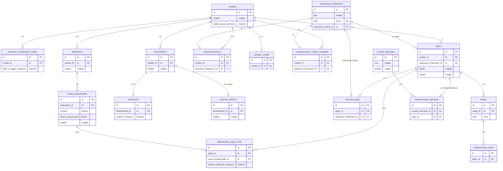
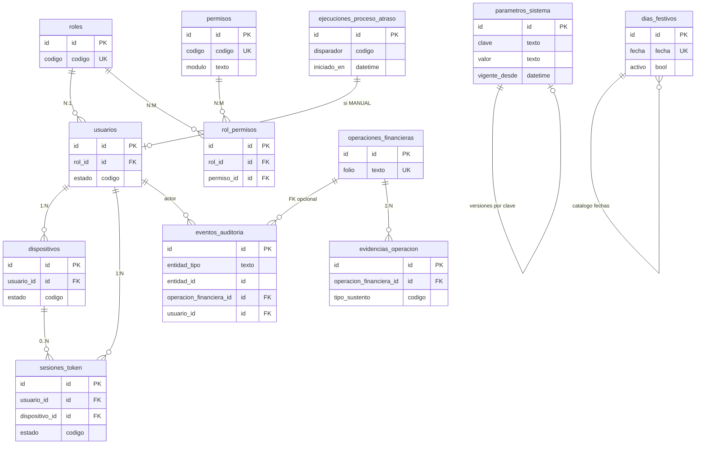

# CREDIMEX — ERD conceptual (modelo lógico)

**Estado:** Aprobado (Fase 3A.2)
**Fecha:** 25 de julio de 2026
**Alcance:** Diagramas Mermaid `erDiagram`. Sin columnas completas.
**Inventario:** 67 tablas (`inventario-tablas-logicas.md`).
**Nombres técnicos:** coinciden con diccionarios y decisiones v1.6.

Los diagramas muestran entidades, claves conceptuales principales y
cardinalidades críticas. No incluyen todas las tablas ni todas las
columnas.

---

## 1. Clientes, rutas y créditos

```mermaid
erDiagram
    roles ||--o{ usuarios : "N:1"
    clientes ||--o{ contactos_alternativos : "1:N"
    clientes ||--o{ referencias : "1:N"
    clientes ||--o{ domicilios_ubicaciones : "1:N"
    clientes ||--o{ documentos_cliente : "1:N"
    clientes ||--o{ confirmaciones_no_duplicado : "1:N"
    clientes ||--o{ asignaciones_cliente_ruta : "1:N"
    rutas ||--o{ asignaciones_cliente_ruta : "1:N"
    rutas ||--o{ asignaciones_ruta_cobrador : "1:N"
    usuarios ||--o{ asignaciones_ruta_cobrador : "cobrador"
    clientes ||--o{ solicitudes_credito : "1:N"
    planes_credito ||--o{ versiones_plan : "1:N"
    versiones_plan ||--o{ solicitudes_credito : "N:1"
    solicitudes_credito ||--o{ autorizaciones_credito : "1:N"
    solicitudes_credito ||--o| creditos : "APROBADA crea"
    clientes ||--o{ creditos : "1:N"
    usuarios ||--o{ asignaciones_temporales_cobranza : "cobrador"
    asignaciones_temporales_cobranza ||--o{ asignaciones_temporales_rutas : "alcance RUTA"
    asignaciones_temporales_cobranza ||--o{ asignaciones_temporales_clientes : "alcance CLIENTE"
    asignaciones_temporales_cobranza ||--o{ asignaciones_temporales_creditos : "alcance CREDITO"
    rutas ||--o{ asignaciones_temporales_rutas : "N:1"
    clientes ||--o{ asignaciones_temporales_clientes : "N:1"
    creditos ||--o{ asignaciones_temporales_creditos : "N:1"
    creditos ||--o| renovaciones : "origen"
    renovaciones }o--|| creditos : "destino"
    clientes ||--o{ restricciones_cliente : "1:N"

    roles {
        id id PK
        codigo codigo UK
    }
    usuarios {
        id id PK
        rol_id id FK
        estado codigo
    }
    clientes {
        id id PK
        nombre texto
        telefono_principal texto
        estado codigo
    }
    rutas {
        id id PK
        nombre texto
        estado codigo
    }
    asignaciones_cliente_ruta {
        id id PK
        cliente_id id FK
        ruta_id id FK
        estado codigo
    }
    asignaciones_ruta_cobrador {
        id id PK
        ruta_id id FK
        cobrador_id id FK
        estado codigo
    }
    asignaciones_temporales_cobranza {
        id id PK
        cobrador_id id FK
        tipo_alcance codigo
        estado codigo
    }
    asignaciones_temporales_rutas {
        id id PK
        asignacion_temporal_id id FK
        ruta_id id FK
    }
    asignaciones_temporales_clientes {
        id id PK
        asignacion_temporal_id id FK
        cliente_id id FK
    }
    asignaciones_temporales_creditos {
        id id PK
        asignacion_temporal_id id FK
        credito_id id FK
    }
    planes_credito {
        id id PK
        nombre texto
    }
    versiones_plan {
        id id PK
        plan_credito_id id FK
    }
    solicitudes_credito {
        id id PK
        cliente_id id FK
        estado codigo
    }
    autorizaciones_credito {
        id id PK
        solicitud_credito_id id FK
        resultado codigo
    }
    creditos {
        id id PK
        cliente_id id FK
        estado codigo
        saldo_actual_centavos importe
        semaforo_actual codigo
    }
    renovaciones {
        id id PK
        credito_origen_id id FK
        credito_destino_id id FK
    }
    restricciones_cliente {
        id id PK
        cliente_id id FK
        estado codigo
    }
    contactos_alternativos {
        id id PK
        cliente_id id FK
    }
    referencias {
        id id PK
        cliente_id id FK
    }
    domicilios_ubicaciones {
        id id PK
        cliente_id id FK
        vigente bool
    }
    documentos_cliente {
        id id PK
        cliente_id id FK
    }
    confirmaciones_no_duplicado {
        id id PK
        cliente_id id FK
    }
```

**Restricciones visuales no dibujadas:** máximo un domicilio vigente; máximo
una asignación cliente–ruta vigente; máximo un titular de ruta vigente;
`tipo_alcance` determina una sola tabla de detalle (D-67); máximo cinco
créditos `ACTIVO` con saldo > 0.

---

## 2. Créditos, calendarios y pagos

**Restricciones visuales no dibujadas:** máximo un calendario `VIGENTE`;
máximo un desembolso `CONFIRMADO`; desembolso confirmado ⇒ una comisión
(D-61); FIFO de aplicaciones.

---

## 3. Caja y libro operativo

```mermaid
erDiagram
    usuarios ||--o| cuentas_operativas : "EFECTIVO_COBRADOR"
    cajas_centrales ||--o| cuentas_operativas : "CAJA_CENTRAL"
    cuentas_bancarias ||--o| cuentas_operativas : "CUENTA_BANCARIA"
    creditos ||--o| cuentas_operativas : "SALDO_CREDITO"
    cuentas_operativas ||--o{ movimientos_cuenta : "1:N"
    operaciones_financieras ||--o{ movimientos_cuenta : "1:N"
    operaciones_financieras ||--o| operaciones_financieras : "operacion_padre_id"
    operaciones_financieras ||--o| operaciones_tesoreria : "1:0..1"
    operaciones_financieras ||--o| gastos_ruta : "GASTO_RUTA"
    operaciones_financieras ||--o{ evidencias_operacion : "1:N"
    operaciones_financieras ||--o| resoluciones_incidencia_caja : "0..1"
    lotes_carga_inicial ||--o{ operaciones_financieras : "CARGA_INICIAL"
    idempotencias_operacion }o--o| operaciones_financieras : "opcional"
    contrapartes_externas ||--o{ operaciones_financieras : "0..N"
    usuarios ||--o{ jornadas_cobrador : "1:N"
    cajas_centrales ||--o{ jornadas_caja_central : "1:N"
    jornadas_cobrador ||--o{ cortes_cobrador : "1:N"
    jornadas_caja_central ||--o{ cortes_caja_central : "1:N"
    jornadas_cobrador ||--o{ gastos_ruta : "1:N"
    jornadas_cobrador ||--o{ excepciones_permanencia_efectivo : "0..N"
    motivos_entrega_fondo ||--o{ entregas_efectivo : "0..N"
    entregas_efectivo }o--o| operaciones_financieras : "al confirmar"
    incidencias_caja ||--o{ resoluciones_incidencia_caja : "1:N"
    entregas_efectivo ||--o{ incidencias_caja : "origen"
    cortes_cobrador ||--o{ incidencias_caja : "origen"
    cortes_caja_central ||--o{ incidencias_caja : "origen"
    creditos ||--o{ visitas_sin_pago : "1:N"
    visitas_sin_pago ||--o{ promesas_pago : "0..N"

    cuentas_operativas {
        id id PK
        tipo codigo
        usuario_cobrador_id id FK
        caja_central_id id FK
        cuenta_bancaria_id id FK
        credito_id id FK
        saldo_actual_centavos importe
        version version
    }
    operaciones_financieras {
        id id PK
        tipo codigo
        folio texto UK
        operacion_padre_id id FK
        lote_carga_inicial_id id FK
    }
    movimientos_cuenta {
        id id PK
        operacion_financiera_id id FK
        cuenta_operativa_id id FK
        importe_con_signo_centavos importe
    }
    operaciones_tesoreria {
        id id PK
        operacion_financiera_id id UK
        subtipo codigo
    }
    gastos_ruta {
        id id PK
        operacion_financiera_id id UK
        jornada_cobrador_id id FK
    }
    idempotencias_operacion {
        id id PK
        ambito codigo
        clave texto
        estado codigo
        operacion_financiera_id id FK
    }
    lotes_carga_inicial {
        id id PK
        referencia_lote texto UK
        estado codigo
    }
    cajas_centrales {
        id id PK
        codigo texto UK
        estado codigo
    }
    jornadas_cobrador {
        id id PK
        cobrador_id id FK
        fecha_operativa fecha
        estado codigo
    }
    jornadas_caja_central {
        id id PK
        caja_central_id id FK
        fecha_operativa fecha
        estado codigo
    }
    cortes_cobrador {
        id id PK
        jornada_cobrador_id id FK
        version version
    }
    cortes_caja_central {
        id id PK
        jornada_caja_central_id id FK
        version version
    }
    entregas_efectivo {
        id id PK
        estado codigo
        importe_recibido_centavos importe
    }
    motivos_entrega_fondo {
        id id PK
        codigo codigo UK
    }
    incidencias_caja {
        id id PK
        estado codigo
        importe_pendiente_centavos importe
    }
    resoluciones_incidencia_caja {
        id id PK
        incidencia_caja_id id FK
        operacion_financiera_id id UK
    }
    excepciones_permanencia_efectivo {
        id id PK
        cobrador_id id FK
        estado codigo
    }
    evidencias_operacion {
        id id PK
        operacion_financiera_id id FK
    }
    contrapartes_externas {
        id id PK
        tipo codigo
    }
    cuentas_bancarias {
        id id PK
        uso codigo
    }
    usuarios {
        id id PK
    }
    creditos {
        id id PK
    }
    visitas_sin_pago {
        id id PK
        credito_id id FK
    }
    promesas_pago {
        id id PK
        credito_id id FK
    }
```

**Restricciones visuales no dibujadas:** exactamente un dueño en
`cuentas_operativas` (D-59); una sola caja `ACTIVA` en V1; UK jornadas;
detalle tesorería solo en seis tipos (D-64).

---

## 4. Seguridad, auditoría y configuración

**Nota D-60:** `entidad_tipo` + `entidad_id` son referencia lógica; la
aplicación valida existencia. No hay FK polimórfica única.

---

## Cobertura respecto al inventario

Los cuatro diagramas cubren las relaciones críticas del inventario de 67
tablas. Tablas de soporte de expediente (contactos, referencias, documentos,
confirmaciones) aparecen en el diagrama 1; cobranza operativa (visitas,
promesas) en el 3; seguridad y batch en el 4.

Nombres técnicos alineados con:

- `inventario-tablas-logicas.md`
- diccionarios por dominio
- `CREDIMEX_Decisiones_Modelo_Logico_v1.6.md`

---

## Referencias

- `docs/04-database/claves-relaciones-restricciones.md`
- `docs/04-database/relaciones-conceptuales.md`
